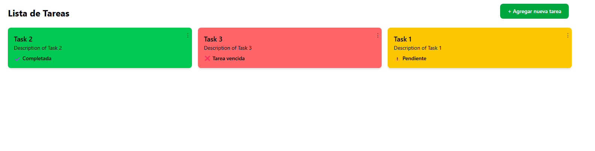
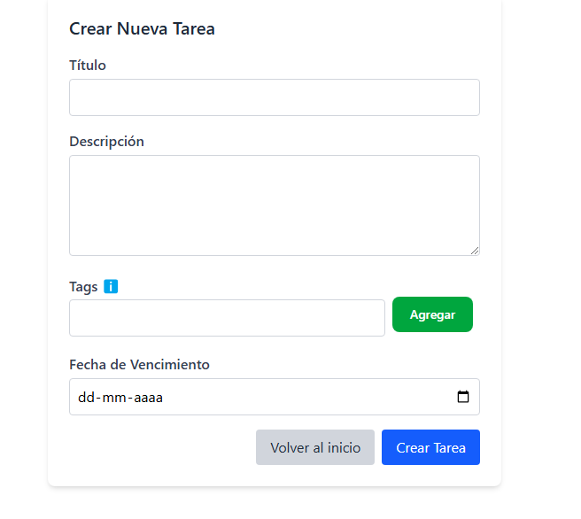
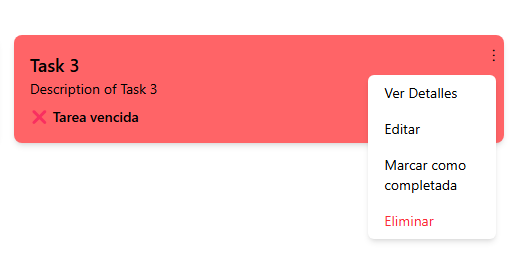
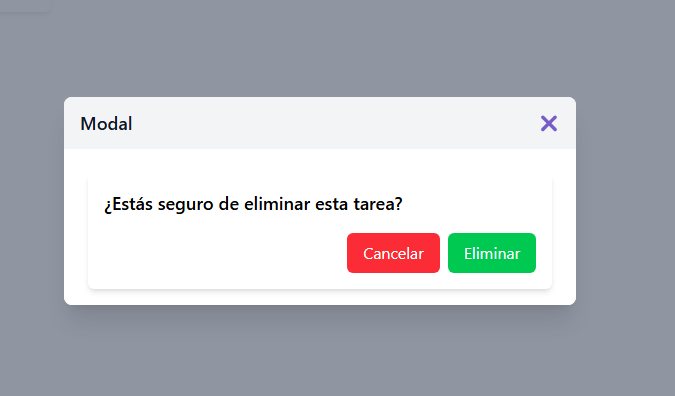
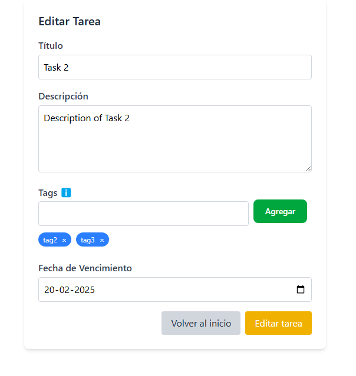
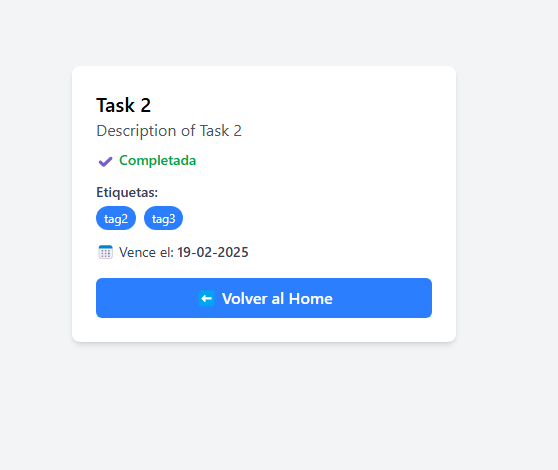

#          Todo-app

## Configuración del entorno
### 1. Configuración del Backend
Agregar un archivo de variables de entorno (`.env`) en el backend con los siguientes valores:  
(Este archivo se incluye solo porque es una prueba técnica. En un entorno real, no se deben publicar credenciales.)

```ini
#--------- Database Configurations ---------#
DATABASE_HOST=postgres
DATABASE_PORT=5432
DATABASE_USER=postgres
DATABASE_PASSWORD=postgres
DATABASE_NAME=todo_db
#--------- Database Configurations ---------#

FRONTEND_URL=http://localhost:5173
```

### 2. Configuración del Frontend
Agregar un archivo de variables de entorno (`.env.local`) en el frontend con los siguientes valores:
```ini
#--------- Database Configurations ---------#
VITE_API_URL=http://localhost:3000
VITE_PORT=5173
```

### 3. Ejecutar docker-compose
Para inicializar el proyecto se debe correr el siguiente comando: **docker-compose up --build**. Se debe tener en cuenta que si se esta en un entorno mac o windows se debe descargar el Docker desktop para su funcionamiento. Esto creara una Base de datos con postgres e instalara las dependencias necesarias

#### Migraciones y seeders
Una vez iniciado los contenedores nos dirigimos en una consulta hacia el proyecto backend y ejecutamos los siguientes comandos:
1.- **npx sequelize-cli db:migrate**
2.- **npx sequelize-cli db:seed:all**

### 4. Estructura del proyecto
├──imagenes
├──todo-backend/ 
│ ├── config/ 
│ ├── dist/ 
│ ├── migrations/ 
│ ├── models/ 
│ ├── seeders/ 
│ ├── src/ 
│ │ ├── common/ 
│ │ ├── modules/ 
│ │ ├── app.controller.spec.ts 
│ │ ├── app.controller.ts 
│ │ ├── app.module.ts 
│ │ ├── app.service.ts 
│ │ ├── main.ts 
│ ├── test/ 
│ ├── .env.example 
│ ├── .gitignore 
│ ├── .prettierrc 
│ ├── Dockerfile 
│ ├── eslint.config.mjs 
│ ├── nest-cli.json 
│ ├── package.json 
│ ├── tsconfig.build.json 
│ ├── tsconfig.json
├──todo-frontend/
│ ├── node_modules/ 
│ ├── public/ 
│ │ ├── src/ 
│ │ ├── assets/ 
│ │ ├── components/ 
│ │ ├── pages/ 
│ │ ├── redux/ 
│ │ ├── routes/ 
│ │ ├── services/ 
│ │ ├── test/ 
│ │ ├── main.tsx 
│ │ ├── styles.css 
│ │ ├── vite-env.d.ts 
│ ├── .dockerignore 
│ ├── .env.example 
│ ├── .gitignore 
│ ├── Dockerfile 
│ ├── eslint.config.js 
│ ├── index.html 
│ ├── package.json 
│ ├── README.md 
│ ├── tsconfig.app.json 
│ ├── tsconfig.json 
│ ├── tsconfig.node.json 
│ ├── vite.config.ts
├──docker-compose.yml
├──README.md

## Funcionalizades del proyecto

### Home
En el Home encontraremos las tareas envueltas en cards donde los colores indican la siguiente información.
**Verde**: Tarea finalizada.
**Amarillo**: Tarea a punto de vencer el plazo.
**Rojo**: Tarea vencida.



### Agregar Tarea
En la esquina superior derecha podremos ver un boton el cual nos va a redirigir al formulario para poder crear una nueva tarea.



### Menu desplegable
Tenemos un menu desplegable en cada Card de las tareas, que realizan las siguientes acciones:
**Ver detalles**: Esta opción nos redigira a una página en la cual podremos ver el detalle completo de la tarea, como sus tags o la fecha en que finaliza.
**Editar**: Esta opción nos redigira al formulario correspondiente para editar la tarea.
**Marcar como completada/incompleta**: Esta opción nos ayudara a cambiar de estado la tarea que seleccionemos.
**Eliminar**: Esta opción nos permitira eliminar una tarea, pero antes nos mostrara un modal de confirmación.








